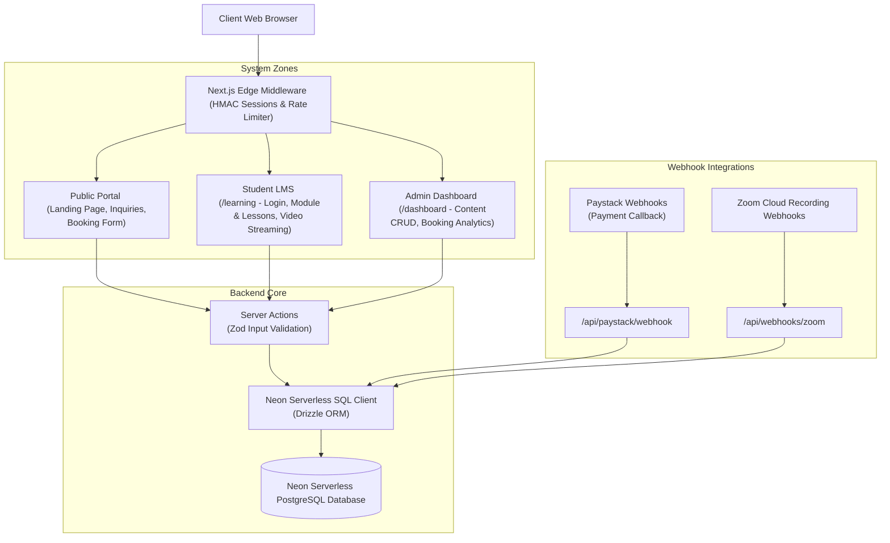
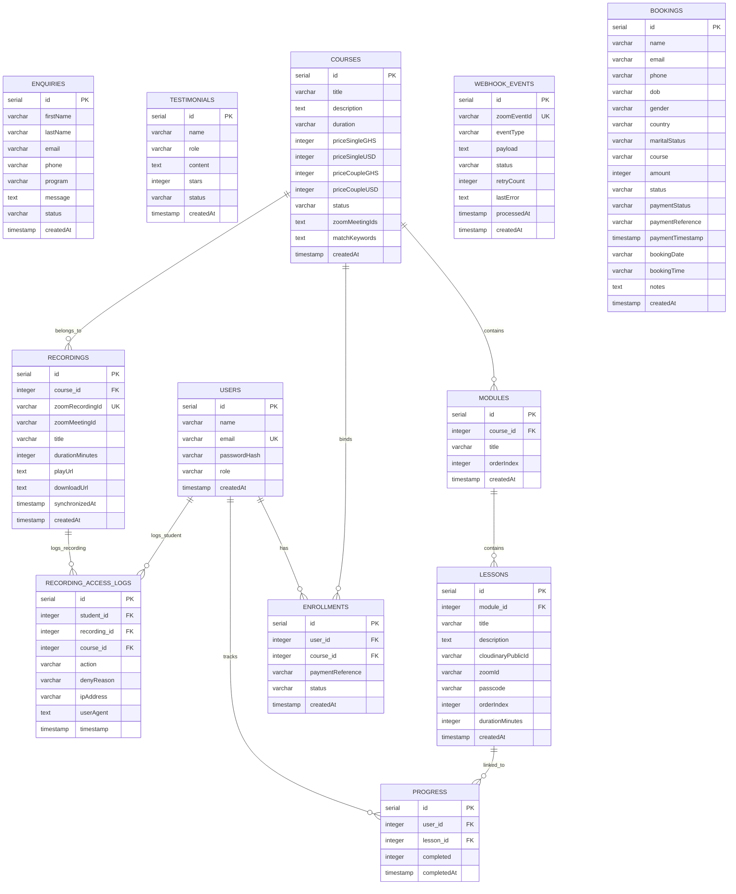
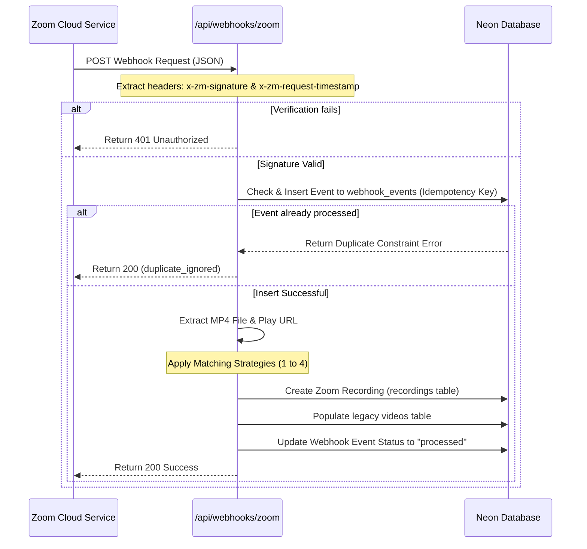
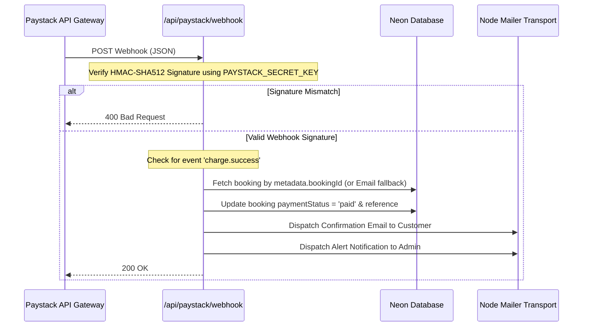

# Love Vibe Studios Web Application Architecture

This document provides a detailed overview of the system architecture, technology stack, directory structure, data models, and core execution flows of the Love Vibe Studios (LVS) web application.

---

## 1. Architectural Overview & Design System

The application is structured as a modern **Next.js Web Application** using the **App Router**, designed with a decoupled architecture containing three main zones:
1. **Public Web Portal**: Content pages, course marketing, enquiry submissions, and enrollment booking systems.
2. **Student Learning Management System (LMS)** (`/learning`): A secure student area for course delivery, video streaming, session tracking, and module progress management.
3. **Admin Dashboard** (`/dashboard`): An administrative dashboard enabling CRUD management of bookings, courses, module listings, student records, and testimonials.

### Architectural Component Diagram



---

## 2. Technology Stack

| Technology / Library | Purpose | Details |
| :--- | :--- | :--- |
| **Next.js 16.2.4 (React 19)** | Core Framework | App Router configuration, Client & Server Components, Server Actions, Edge Middleware. |
| **PostgreSQL (Neon)** | Database | Hosted Serverless Postgres instance for relational data storage. |
| **Drizzle ORM** | Object-Relational Mapper | Type-safe SQL client schema definition, migrations tool, and query building. |
| **Upstash Redis & Rate Limit** | Rate Limiting | Used for sliding window rate limiting on sensitive routes to prevent API misuse and brute force attacks. |
| **Nodemailer** | SMTP Client | Relays email alerts to admins and HTML payment receipts to customers. |
| **Cloudinary** | Media Manager | Hosts custom course module materials and static resources. |
| **Lenis & Scroll Animations** | UX/Animations | Premium scrolling behavior and animation controllers. |
| **Zod** | Schema Validation | Server Actions utilize strict validation schemas for user inputs. |
| **Vitest** | Testing Suite | Local unit and integration tests setup for middleware and API logic. |

---

## 3. Visual Identity & Color Schemes

The application implements a premium, cohesive custom color palette configured via CSS Variables at the root level in [app/globals.css](file:///c:/Users/BLUEWAVE%20COMP/Documents/projects/LVSweb/app/globals.css). The color design tokens represent a tailored, harmonized theme blending elegant violets, deep indigo-purples, and warm gold accents:

### Color Palette

| Token | CSS Variable | Hex Code | Visual Application & Description |
| :--- | :--- | :--- | :--- |
| **Cream** | `--cream` | `#F5F0FF` | Primary canvas/background color. Light violet-lavender undertone provides a premium feel compared to generic gray/white. |
| **Blush** | `--blush` | `#D8C2F5` | Soft violet highlights, container borders, and element backgrounds. |
| **Rose** | `--rose` | `#7B3FA0` | Primary accent color. Used for key callouts, primary buttons on hover, sub-tags, and interactive active states. |
| **Deep** | `--deep` | `#2D1B4E` | Base text color, high-contrast title typography, and solid background elements (e.g., solid buttons, navigation bars). |
| **Gold** | `--gold` | `#D4AF37` | Secondary highlight accent. Used for star ratings (testimonials), warning status states, or special highlighted options. |
| **Muted** | `--muted` | `#7A6B9A` | Neutral, secondary gray-violet for captions, placeholders, metadata text, and disabled states. |
| **White** | `--white` | `#FFFFFF` | Core white for layouts, card elements, and high-contrast texts. |

### Typography

To match the premium color tones, the typography system is paired:
*   **Headings & Display**: `Cormorant Garamond` — An elegant, high-contrast serif font conveying premium quality.
*   **Body & Navigation**: `Jost` — A modern, geometric sans-serif ensuring highly legible body content and clean UI structure.

---

## 4. Directory Layout

A structured map of critical files and directories inside the project:

```text
├── .env.local                  # Environment-specific configuration
├── drizzle.config.ts           # Drizzle schema pathing and db configuration
├── middleware.ts               # Core route protection and API rate-limiting logic
├── package.json                # Project dependencies and script actions
├── tsconfig.json               # TypeScript configuration
├── vitest.config.ts            # Testing suite configuration
├── app/                        # App Router Pages and API Endpoints
│   ├── api/                    # Server-side API Endpoints
│   │   ├── auth/               # Admin auth controllers
│   │   ├── bookings/           # Booking data retrieval
│   │   ├── learning/           # LMS Student auth endpoints
│   │   ├── paystack/           # Paystack payment initiation & verification webhooks
│   │   └── webhooks/zoom/      # Zoom Cloud recording ingestion webhook
│   ├── dashboard/              # Protected admin panel layouts and pages
│   ├── learning/               # LMS Student login, courses dashboard, and lesson player
│   └── page.tsx                # Public Landing Page route
├── components/                 # Shared React Components
│   ├── LenisProvider.tsx       # Lenis smooth scroll provider setup
│   ├── dashboard/              # Components specific to the Admin Panel (Sidebar, Topbar)
│   └── public/                 # Home and marketing sections (Hero, Pricing, Testimonials, Books)
├── lib/                        # Core Utilities & State
│   ├── actions.ts              # Unified Server Actions file (Zod checks, CRUD logic)
│   ├── db.ts                   # Drizzle Client instantiator
│   ├── schema.ts               # Relational Database schema exports
│   ├── session.ts              # HMAC Web Crypto session signer
│   └── email-utils.ts          # Email rendering helper functions
└── specs/                      # Engineering and feature specifications
    └── 001-zoom-recording-access/ # System designs & data-models for Zoom Recording Sync
```

---

## 5. Database Schema Definition

All tables are defined in [lib/schema.ts](file:///c:/Users/BLUEWAVE%20COMP/Documents/projects/LVSweb/lib/schema.ts) using Drizzle schema-definitions:



### Table Details Summary
*   **`bookings`**: Records both pending and completed purchases for courses or private sessions (e.g. Telephone, Virtual, or Walk-In).
*   **`courses`**, **`modules`**, **`lessons`**: Define standard structures of the Learning Management System hierarchy.
*   **`users`**, **`enrollments`**, **`progress`**: Manage student identities, active courses, and lesson completion checkpoints.
*   **`recordings`**: Holds specific cloud recording assets synchronized from Zoom events.
*   **`webhook_events`**: Ensures Zoom webhook delivery is idempotent and durable.
*   **`recording_access_logs`**: An audit trail tracking views and denials of Zoom class recordings.

---

## 6. Core Architectural Flows

### A. Zoom Webhook Processing Pipeline
When a class ends, Zoom emits a `recording.completed` event. The webhook handler in `app/api/webhooks/zoom/route.ts` manages this data in a secure, multi-stage ingestion routine:



#### Meeting-to-Course Matching Logic
To tie an incoming Zoom recording file to the correct course, the webhook applies four matching steps, progressing from highest precision to broad fallback:
1.  **Exact ID Match**: Compares the incoming numeric Zoom meeting ID against comma-separated Zoom IDs registered under `courses.zoomMeetingIds`.
2.  **Normalized Title & Keywords Match**: Normalizes the meeting topic string (lowercasing and stripping symbols) and compares it against course titles and custom comma-separated search terms inside `courses.matchKeywords`.
3.  **Lesson Topic Match**: Searches for any lesson title matching the meeting topic to find the corresponding course parent.
4.  **Host Email Match**: Resolves the meeting host's email to a student profile, matching the recording with their most recent active course enrollment.

---

### B. Paystack Payment Webhook Flow
Secure automated enrollment relies on Paystack's callback notifications:



---

### C. Rate Limiting and Route Protection (Middleware)

Next.js Edge-compatible middleware (`middleware.ts`) protects system integrity by filtering incoming requests before reaching route handlers:

1.  **Sensitive Routes Rate Limiter**:
    *   Targets `/api/auth`, `/api/learning/auth`, and Paystack payment initialization endpoints.
    *   **Production Engine**: Evaluates requests using `@upstash/ratelimit` (sliding window rate-limiter over Upstash Redis) which operates seamlessly in multi-region serverless runtimes.
    *   **Local Development Fallback**: If Upstash environment credentials are not present, it defaults to a local, in-memory `Map` lookup caching requests by IP, failing open on any errors to ensure offline workflow continuity.
2.  **Admin Zone Route Protection**:
    *   Matches all `/dashboard/:path*` targets.
    *   Checks for the `dashboard_auth` cookie.
    *   Verifies the token using Web Crypto HMAC signature validation. If invalid, the request is redirected to `/login?from=[destination_path]`.

---

## 7. Security and Session Management

Rather than storing plaintext identifiers, the application leverages cryptographically signed session tokens for secure panel access.

*   **Format**: `v1.<timestampMs>.<nonce>.<hmac>`
*   **Hashing Engine**: The Web Crypto API (`HMAC-SHA256`) is used. This allows the session validation functions to run directly in low-overhead Edge environments without importing heavy Node-specific packages.
*   **Validity Duration**: Tokens are generated with a strict 7-day expiration limit.
*   **Constant-Time Verification**: Comparison is handled natively by the runtime environment to safeguard against timing side-channel attacks.
*   **Environment Secret**: Secure generation relies on `SESSION_SECRET` configuration.
